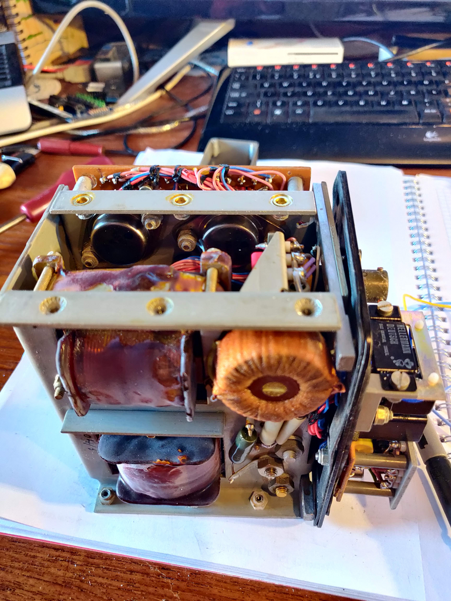

# Aviation_Static_Invertor
Ferranti FI59 115V 400Hz single phase inverter with standby / backup function

The Inverter is powered by 26 VDC, it has an AC input which when above the trip voltage of 88 volts AC inhibits the inverter. 

The input is normally passed directly to the output, however if the input voltage falls below the trip voltage the inverter is activated and fed to the output terminals instead of the input voltage. The inverter is disabled if the AC input returns above 90 VAC

The video shows the the inverter feeding the input to the output, DC being applied, and then the AC input being lowered until the inverter starts. This is when the neon indicator turns on.

There is a neon lamp visible when the inverter is activated.

There is a test function activated by a button accesible from the outside of the unit, when pressed it forces the inverter to start and switch the output terminals to the inverter output voltage.

Video of the unit in peration being fed with 26 VDC and a veriable voltage AC supply.

[video](https://youtube.com/shorts/nxcaFDpzbHE)

Photos of the inside of the inverter.

[pictures](./images/README.md)

